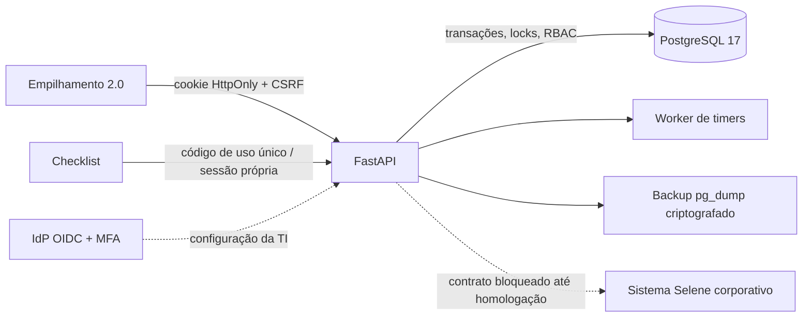

# Arquitetura

Um processo FastAPI serve as duas interfaces estáticas e a API sob `/api/site-selene`. PostgreSQL 17 é a única fonte de verdade. O worker interno liquida movimentos cujo timer de 10 segundos venceu, expira códigos e libera leases vencidos. Eventos SSE apenas avisam o cliente para buscar novamente o estado autorizado; eles não transmitem dados operacionais de outro usuário.

## Regras centrais

- A migration `0001_operational` cria schema, índices, constraints, perfis e permissões. Não cria usuários, dispositivos, equipamentos ou dados operacionais.
- Operações de palete usam transação, `SELECT FOR UPDATE`, advisory locks e versão otimista.
- O estado segue uma máquina explícita: `WAITING`, `ASSIGNED`, `LOWER_AUTHORIZED`, `LOWERING`, `FLOOR`, `READY`/`RAISE_AUTHORIZED`, `RETURNING`, `COMPLETED` ou `CANCELLED`.
- BAIXAR e SUBIR exigem autorização de servidor, sessão, permissão, produção aberta, dispositivo arrendado e lock do palete.
- Históricos, respostas de Checklist e auditoria recebem proteção append-only por trigger e por privilégios do usuário de runtime.
- O audit log usa encadeamento HMAC SHA-256 verificável com `python -m app.admin verify-audit`.
- Códigos do Checklist são aleatórios, têm 6 dígitos, validade de 2 minutos, hash no banco, uso único e rate limit persistente.
- Service workers guardam somente arquivos estáticos. Sem API, as operações fecham com erro; não há fallback local.

As 33 tabelas abrangem identidade, dispositivos, produção, paletes, autorizações, movimentos e locks, códigos, equipamentos, Checklist, pendências, notificações, históricos, auditoria, configuração, rate limit, idempotência, OIDC e eventos técnicos. A lista está em [BANCO-E-API.md](BANCO-E-API.md).

Autorizações são registros próprios e carregam ação, origem, aprovador, validade, estado, motivo e metadados. Isso permite introduzir aprovação por duas pessoas numa migration futura. O recurso não foi habilitado porque a política corporativa ainda não foi fornecida.
